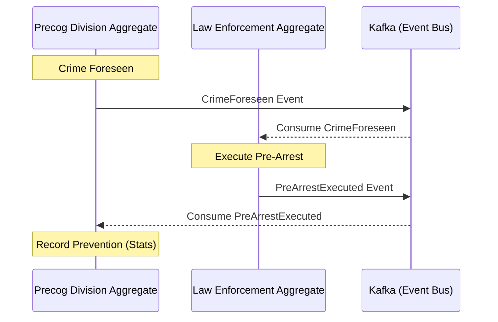

# Pre-Crime Application

This application demonstrates the principles of **Domain-Driven Design (DDD)** and **Onion Architecture** within a modern Spring Boot and Kotlin ecosystem.

## Purpose
The project serves as a reference implementation for:
- **Onion Architecture**: Separation of concerns where the domain core is independent of infrastructure and UI.
- **DDD Patterns**: Implementation of Aggregates, Repositories, Domain Events, and Services.
- **Event-Driven Communication**: Using Kafka for asynchronous communication between aggregates.
- **Transactional Outbox Pattern**: Ensuring reliable event delivery without distributed transactions.

## Concept
The application is loosely based on the movie **"Minority Report"**. It models a futuristic "Pre-Crime" department where:
- **Precog Division**: Foresees future crimes and publishes visions.
- **Law Enforcement**: Responds to these visions by executing "pre-arrests" before the crime occurs.
- **Feedback Loop**: Successful arrests are reported back to update statistics, completing the cycle of crime prevention.

## Architecture Diagram

The following diagram illustrates the main aggregates and the event-driven flow between them:

### Layered Structure (Onion)
1. **Domain Layer**: Contains the business logic, entities (`PrecogDivision`, `LawEnforcementUnit`), and domain events.
2. **Application Layer**: Orchestrates the business flow through `PreCrimeApplicationService`.
3. **Infrastructure Layer**: Handles technical details like persistence (jOOQ), messaging (Kafka), and security.
4. **UI Layer**: (In `ui/`) A modern frontend to visualize the pre-crime activities.
