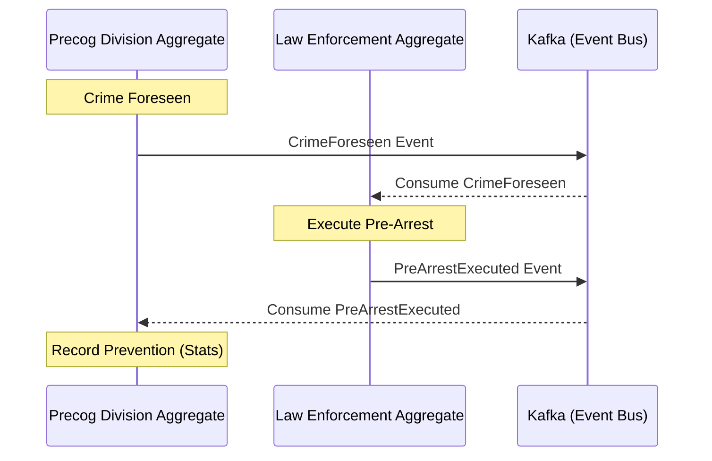

# Pre-Crime Application

This application is a reference implementation of **Domain-Driven Design (DDD)** and **Onion Architecture** using a
modern Kotlin/Spring Boot backend and an Angular frontend. It is themed around a futuristic "Pre-Crime" department.

## Purpose

The project demonstrates:

- **Onion Architecture**: Strict separation between `domain`, `application`, and `infrastructure` layers.
- **DDD Patterns**: Implementation of Aggregates, Entities, Value Objects, Domain Events, and Repositories using *
  *jMolecules**.
- **Event-Driven Communication**: Using **Kafka** for asynchronous communication between aggregates.
- **Transactional Outbox Pattern**: Ensuring reliable event delivery without distributed transactions.

## Concept

The application is loosely based on the movie **"Minority Report"**. It models a futuristic "Pre-Crime" department
where:

- **Precog Division**: Foresees future crimes and publishes visions.
- **Law Enforcement**: Responds to these visions by executing "pre-arrests" before the crime occurs.
- **Feedback Loop**: Successful arrests are reported back to update statistics, completing the cycle of crime
  prevention.

## Architecture Diagram

The following diagram illustrates the main aggregates and the event-driven flow between them:



## Technical Stack

| Component            | Technology                                |
|----------------------|-------------------------------------------|
| **Backend**          | Kotlin 2.3.21, Java 25, Spring Boot 4.0.6 |
| **Frontend**         | Angular 21, TypeScript, Vanilla CSS       |
| **Persistence**      | PostgreSQL 18, jOOQ, Flyway               |
| **Messaging**        | Kafka 4.2.0                               |
| **Testing**          | JUnit 5, ArchUnit, jMolecules-test        |
| **Containerization** | Docker Compose                            |

## Building and Running

### Prerequisites

- Java 25+
- Node.js (v22+)
- Docker & Docker Compose

### Infrastructure

Start the database and Kafka:

```bash
docker-compose up -d
```

### Backend

Run the Spring Boot application:

```bash
./mvnw spring-boot:run
```

Tests: `./mvnw test`

### Frontend

Navigate to the `ui` directory and start the dev server:

```bash
cd ui
npm install
npm start
```

The UI will be available at `http://localhost:4200` (proxied to `/api` on `localhost:8080`).

## Development Conventions

- **Onion Constraints**: Architectural boundaries are enforced by **ArchUnit** and **jMolecules** in
  `ArchitectureTest.kt`.
- **Domain First**: Business logic resides strictly in the `domain` package and should have no dependencies on external
  frameworks (except jMolecules annotations).
- **Type-Safe SQL**: All database interactions use **jOOQ**.
- **Reliable Messaging**: Never publish directly to Kafka from the application service. Use `DomainEventPublisher`,
  which persists events to the `outbox` table within the same transaction.
- **Kotlin Style**: Use idiomatic Kotlin (data classes, expressions, null safety).
